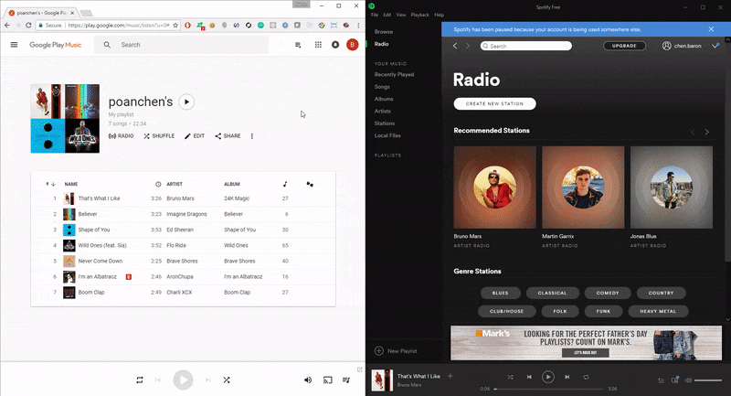

# google-play-music-playlist-exporter v0.0.1

A Google Chrome Extension that will help user to export their playlist and allowing potential import into other music service (such as Spotify) with a click of a button.

## Demo


## Why is this useful?

It can be tough/uneasy to manually move all your favorite music in your playlist from one service to another one. To make user's life a lot easier. This Google Chrome Extension will help user to export their music playlist with a click of a button.

## Installation

```
git clone https://github.com/poanchen/google-play-music-playlist-exporter.git
cd google-play-music-playlist-exporter
```

Next, if you are on Mac OSX or Linux. Run the downloadImmutableJS bash script, (to download the ImmutableJS script)
```
./downloadImmutableJS.sh
```

Otherwise, you must download the immutableJS library from https://cdnjs.cloudflare.com/ajax/libs/immutable/3.8.1/immutable.min.js and save it into the directory.

Then, you must manually add the Chrome Extension in your Chrome.

## Disclaimer
Some of the code was derived and inspired from [export_google_music.js](https://gist.github.com/jmiserez/c9a9a0f41e867e5ebb75) by [jmiserez](https://github.com/jmiserez).
